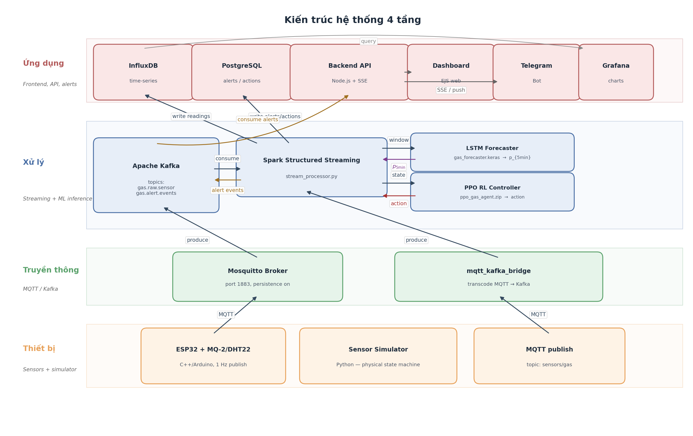
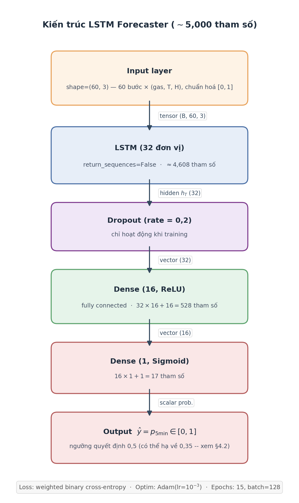
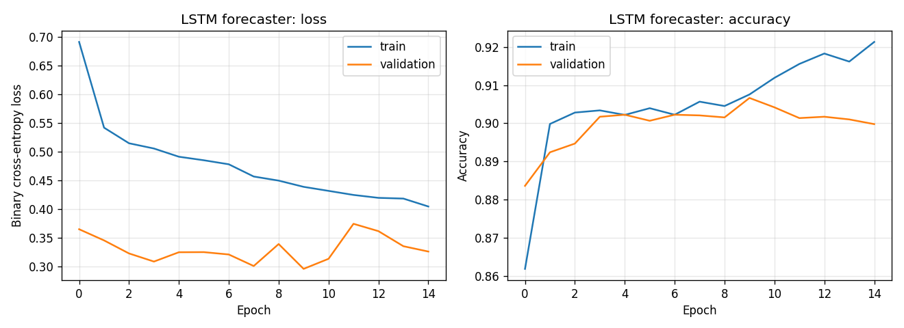
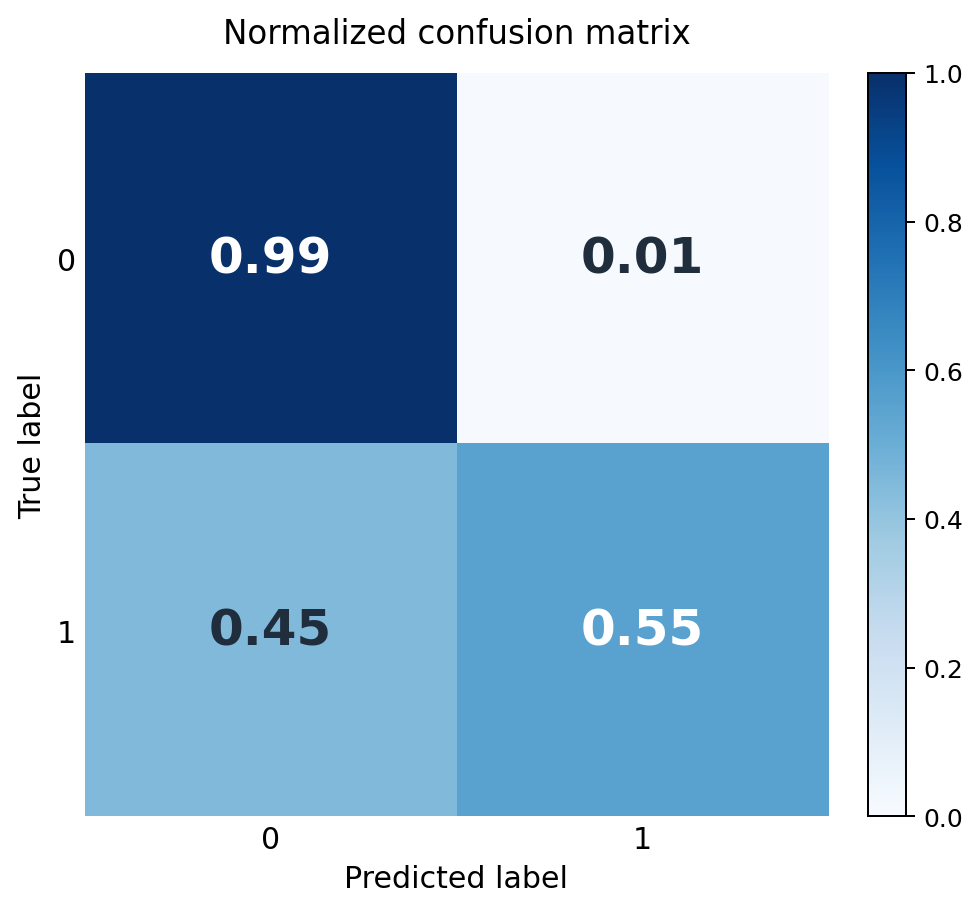
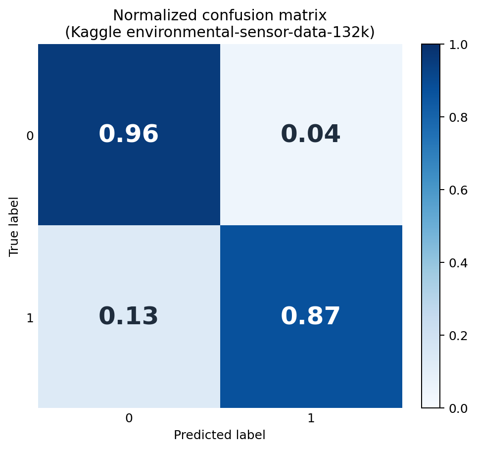
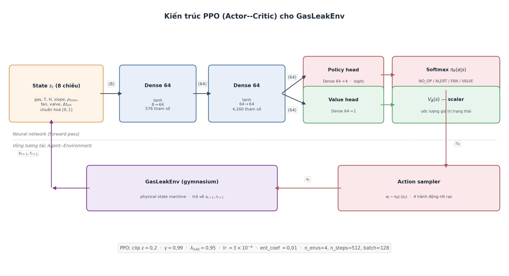
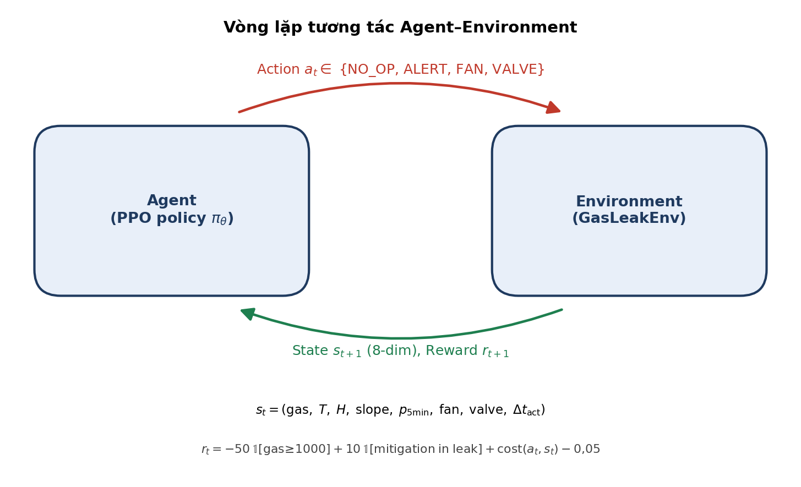
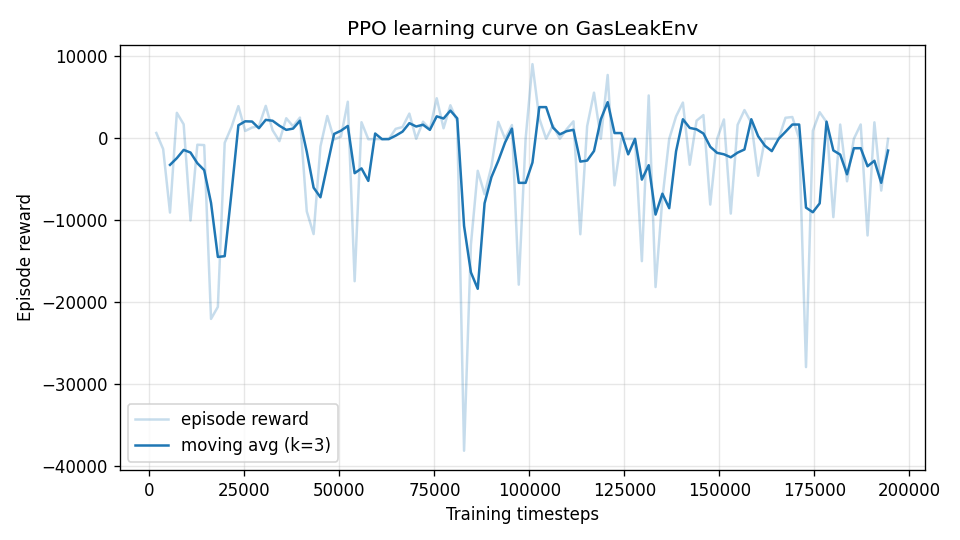
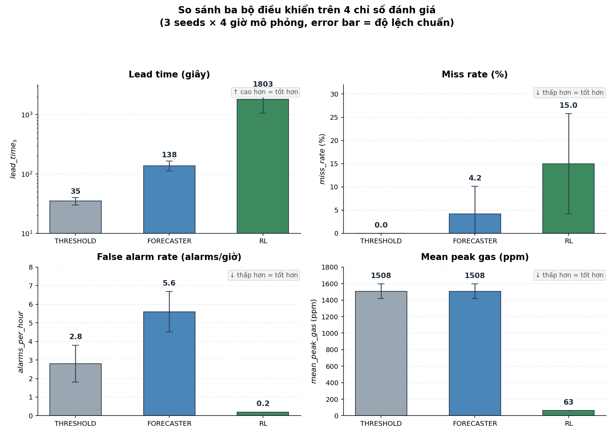
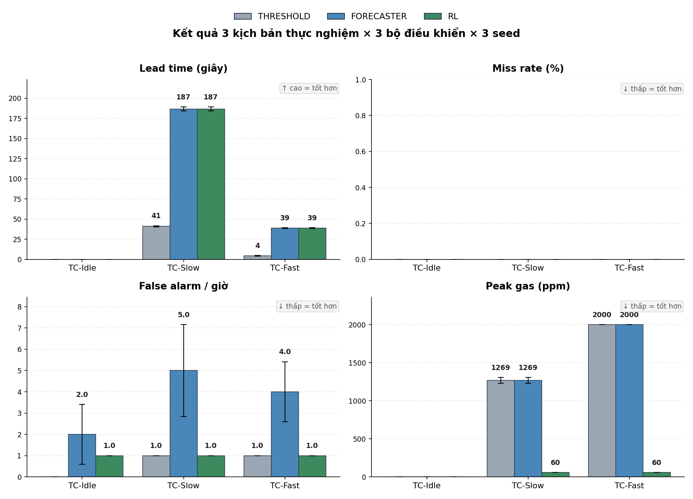

<!-- _class: lead -->

# BÁO CÁO TIẾN ĐỘ KHÓA LUẬN TỐT NGHIỆP

## HỆ THỐNG PHÁT HIỆN RÒ RỈ KHÍ GAS THÔNG MINH

### Tích hợp IoT, dự báo LSTM và học tăng cường PPO

*A Smart Gas Leak Detection System integrating IoT, LSTM Forecasting and PPO Reinforcement Learning*

**GVHD:** ThS. Nguyễn Khánh Thuật

**Sinh viên thực hiện:**
- Lê Viết Dương — 22520300 — MMTT2022.1
- Quách Minh Đông — 22520259 — MMTT2022.1

---

## NỘI DUNG BÁO CÁO

| **01** | **02** | **03** |
|:---|:---|:---|
| **TỔNG QUAN ĐỀ TÀI** | **NGHIÊN CỨU LIÊN QUAN** | **TIẾN ĐỘ HIỆN TẠI** |
| Bối cảnh rò rỉ khí gas | Các bài báo liên quan | Kiến trúc 4 lớp |
| Vai trò của IoT + AI | Hướng tiếp cận LSTM + PPO | Kết quả huấn luyện |
| Thách thức ngưỡng tĩnh | Mục tiêu đề tài | Benchmark + đánh giá |

---

<!-- _class: lead -->

# 01
# TỔNG QUAN ĐỀ TÀI

---

## RÒ RỈ KHÍ GAS – NGUY CƠ NGHIÊM TRỌNG

- Khí gas hóa lỏng (**LPG**) và khí tự nhiên được dùng rộng rãi trong hộ gia đình và sản xuất tại Việt Nam.
- Theo Cục PCCC&CNCH, hàng năm xảy ra **hàng trăm vụ cháy nổ** liên quan đến rò rỉ khí gas — thiệt hại lớn về người và tài sản.
- Phần lớn các vụ rò rỉ xảy ra **âm thầm**, người dùng chỉ phát hiện khi nồng độ đã đạt mức nguy hiểm hoặc khi ngửi thấy mùi.

> Câu hỏi đặt ra: làm sao **dự báo sớm** rò rỉ và **tự động ứng phó** trước khi đạt ngưỡng nguy hiểm?

---

## VAI TRÒ CỦA IoT + AI

| 01 — Cảnh báo sớm | 02 — Phản ứng tự động | 03 — Giám sát từ xa |
|:---|:---|:---|
| Dự báo trước 5 phút bằng LSTM trên chuỗi cảm biến | RL agent tự bật quạt, đóng van — không phụ thuộc người dùng | Telegram bot + dashboard realtime |
| Có thời gian sơ tán, can thiệp | Giảm peak gas xuống mức nền | Defense-in-depth qua 2 kênh |

---

## THÁCH THỨC CỦA HỆ THỐNG NGƯỠNG TĨNH

- **Phản ứng muộn**: chỉ cảnh báo khi gas đã đạt 10% LEL → người dùng có khi đã ngửi thấy mùi.
- **False alarm**: dao động nhiệt độ / độ ẩm dễ kích hoạt cảnh báo nhầm.
- **Không dự báo**: không phân biệt được leak đang tăng dần với mức nền cao ổn định.
- **Phản ứng đơn lẻ**: chỉ phát còi, không tự đóng van / bật quạt.

→ Cần thay thế bằng tiếp cận **dự báo + điều khiển tự động** dựa trên học máy.

---

<!-- _class: lead -->

# 02
# NGHIÊN CỨU LIÊN QUAN

---

## CÁC CÔNG TRÌNH LIÊN QUAN

| Tên bài báo | Tóm tắt nội dung | Hạn chế |
|:---|:---|:---|
| Saranya 2023 — Gas Leakage Detection w/ Arduino | Arduino + MQ-2 + SMS alert | Ngưỡng tĩnh, không dự báo |
| Nwazor 2023 — IoT Gas Leak Detection | ESP8266 + mobile app | Phản ứng, không can thiệp |
| Gambiroza 2020 — LSTM transient | LSTM học đặc tính quá độ MQ | Phân loại loại khí, chưa forecast |
| Abbas 2021 — Neural classification | NN phân loại mức nguy hiểm | Phân loại tức thời, không dự báo |
| Wei 2022 — DRL offloading | DRL cho pipeline công nghiệp | Không phải nhà ở |

→ **Khoảng trống**: chưa có nghiên cứu tích hợp **đồng thời** (i) LSTM dự báo, (ii) RL điều khiển, (iii) pipeline streaming cho nhà ở.

---

## HƯỚNG TIẾP CẬN CỦA ĐỀ TÀI

### LSTM Forecasting

Dự báo xác suất gas vượt 1000 ppm trong **5 phút tới** dựa trên cửa sổ 60s. Thay ngưỡng tĩnh bằng tín hiệu liên tục $p_{5\min} \in [0, 1]$.

### PPO Reinforcement Learning

Học chính sách chọn hành động tối ưu: **NO_OP / ALERT / FAN_ON / CLOSE_VALVE**. Hàm reward cân bằng hiệu quả can thiệp với chi phí false alarm.

### Pipeline streaming hiện đại

MQTT → Kafka → Spark Structured Streaming → InfluxDB → Telegram + Grafana.

---

## MỤC TIÊU ĐỀ TÀI

| Hạng mục | Mô tả |
|:---|:---|
| Bộ mô phỏng vật lý | Máy trạng thái 4 pha với ground-truth, tái tạo được |
| LSTM Forecaster | Dự báo nhị phân $p_{5\min}$ thay vì phân loại trạng thái |
| PPO RL Controller | Đa hành động trong môi trường Gymnasium tích hợp vật lý |
| Streaming pipeline | Kafka + Spark — độ trễ end-to-end < 1 giây |
| Telegram chatbot | Cảnh báo đẩy + điều khiển từ xa, không cần app riêng |
| Oracle two-pass | So sánh công bằng các bộ điều khiển |
| Docker Compose | 10 services, khởi động bằng 1 lệnh |

---

<!-- _class: lead -->

# 03
# TIẾN ĐỘ HIỆN TẠI

---

## TIẾN ĐỘ TỔNG THỂ THEO KẾ HOẠCH GANTT

| Giai đoạn | Nội dung | Tiến độ |
|:---|:---|:---:|
| GĐ1 | Phân tích & thiết kế kiến trúc 4-layer | **Hoàn thành** |
| GĐ2 | Triển khai IoT + Data Pipeline (MQTT/Kafka/Spark) | **Hoàn thành** |
| GĐ3 | Phát triển mô hình AI (LSTM + PPO) | **Hoàn thành** |
| GĐ4 | Application (Backend, Dashboard, Telegram) | **95%** |
| – | Bản thảo LaTeX (5 chương, ~1.770 dòng) | **95%** |

**Bổ sung gần đây (12/05/2026):**

- Đánh giá LSTM trên **dữ liệu cảm biến thực Kaggle 132K** (~405k mẫu).
- Bootstrap 95% CI cho tất cả chỉ số đánh giá.

---

## KIẾN TRÚC HỆ THỐNG 4 LỚP



**Luồng**: ESP32 → MQTT → Kafka → Spark → LSTM + PPO → InfluxDB → Telegram/Grafana

---

## BỘ MÔ PHỎNG VẬT LÝ TRẠNG THÁI

**Máy trạng thái 4 pha** với phương trình động lực học vật lý:

| Pha | Phương trình | Ý nghĩa |
|:---|:---|:---|
| NORMAL | $gas \to 60$ ppm + Gauss(3) | Trạng thái nền |
| LEAK_SLOW | $gas += 5$ ppm/s | Rò rỉ van chậm |
| LEAK_FAST | $gas \cdot e^{0.04t} + 8t$ | Vỡ ống — hàm mũ |
| VENTILATING | $gas \cdot e^{-0.03t}$ | Sau khi đóng van / quạt |

Seed cố định → tái tạo 100%. Cung cấp **ground-truth** (`_leak_state`, `_seconds_to_critical`) cho Oracle two-pass.

---

## DỮ LIỆU HUẤN LUYỆN

| Thí nghiệm | Cấu hình | Số mẫu | Tỷ lệ + |
|:---|:---|---:|---:|
| LSTM (simulator) | 8h × 1Hz, seed=42 | 28.439 | 26,18% |
| └─ train (80%) | chronological | 22.751 | 26,1% |
| └─ test (20%) | tail | 5.688 | 21,2% |
| **LSTM (Kaggle thực)** | 405k mẫu, 3 Raspberry Pi | **404.101** | **5,3%** |
| └─ train (80%) | per-device chronological | 323.280 | 8,5% |
| └─ test (20%) | tail | **80.821** | 1,3% |
| PPO RL | 200k timesteps × 4 envs × 1800s | 200.000 | – |
| Benchmark | 4h × 1Hz × 3 seeds | 14.400/seed | – |

---

## KIẾN TRÚC LSTM FORECASTER



```
Input(60, 3) → LSTM(32) → Dropout(0.2) → Dense(16, relu) → Dense(1, sigmoid)
              ~5.153 tham số · binary cross-entropy · Adam(1e-3)
```

- **Đầu vào**: cửa sổ 60s × 3 đặc trưng (`gas, temp, humidity`).
- **Đầu ra**: $p_{5\min}$ — xác suất gas vượt 1000 ppm trong 5 phút tới.
- **Nhãn**: $y_t = 1$ iff $\max(gas_{t+1..t+300}) > 1000$ ppm.

---

## HUẤN LUYỆN LSTM (SIMULATOR)



Train acc ~92%, val acc ~90%, không overfit, hội tụ sau epoch 8–10.

---

## MA TRẬN NHẦM LẪN — LSTM (SIMULATOR)



---

## KẾT QUẢ LSTM TRÊN SIMULATOR

| Chỉ số | Giá trị | Diễn giải |
|:---|:---:|:---|
| Accuracy | **89,98%** | Tổng quát đúng |
| **Precision** | **95,68%** | Rất ít kêu nhầm |
| Recall | 55,15% | Bỏ sót giai đoạn rất sớm LEAK_SLOW |
| F1 | 69,97% | – |
| TP / FP | 664 / 30 | – |
| TN / FN | 4.454 / 540 | – |

→ Mô hình có **Precision rất cao**, Recall trung bình do giới hạn cố hữu (khi rò rỉ chưa rõ xu hướng thì không thể dự đoán).

---

## ĐÁNH GIÁ LSTM TRÊN DỮ LIỆU THỰC (KAGGLE) – MỚI

**Dataset:** `garystafford/environmental-sensor-data-132k`
**~405k mẫu** · 3 Raspberry Pi (MQ-2, MQ-7) · 7 ngày T7/2020



---

## SO SÁNH SIMULATOR vs KAGGLE THỰC

| Chỉ số | Simulator (5.688 mẫu) | **Kaggle thực (80.821 mẫu)** |
|:---|:---:|:---:|
| Accuracy | 89,98% | **95,56%** |
| Precision | **95,68%** | 21,15% |
| Recall | 55,15% | **87,36%** |
| F1 | **69,97%** | 34,05% |
| Tỷ lệ + test | 21,2% | 1,3% |

**95% Bootstrap CI (Kaggle)**: Accuracy [95,4; 95,7] · Recall [85,2; 89,2]

→ **Mô hình KHÔNG bị overfit simulator** — áp lên dữ liệu cảm biến vật lý thực vẫn đạt Accuracy 95% & Recall 87%. Tín hiệu xu hướng tăng LPG đã học có tính tổng quát.

---

## KIẾN TRÚC PPO RL CONTROLLER



```
MlpPolicy: Dense(64) → Dense(64) → [Policy head 4 actions  |  Value head]
γ=0.99 · λ_GAE=0.95 · clip ε=0.2 · lr=3e-4 · ent_coef=0.01
```

- **Quan sát** $s_t$ 8 chiều: `gas, temp, humid, slope, p_5min, fan_on, valve_closed, time_since_action`.
- **Hành động** $a_t \in \{$NO_OP, ALERT, FAN_ON, CLOSE_VALVE$\}$.

---

## VÒNG TƯƠNG TÁC RL VỚI MÔI TRƯỜNG



200k timesteps × 4 môi trường song song × episode 1800s · ~3 phút 30 giây trên CPU · throughput ~960 fps.

---

## KẾT QUẢ HUẤN LUYỆN PPO



Reward hội tụ về dải [-2000; -1800]. Reward âm do hệ số phạt –50 cho mỗi bước gas ≥ 1000 ppm — không phản ánh policy kém: bằng chứng chính sách tốt thể hiện qua peak gas chỉ 63 ppm trong benchmark.

---

## TỔNG HỢP HUẤN LUYỆN HAI MÔ HÌNH

| Hạng mục | LSTM Forecaster | PPO RL Controller |
|:---|:---|:---|
| Loại | Supervised, time-series | RL on-policy |
| Bài toán | Dự báo nhị phân $p_{5\min}$ | Điều khiển 4 hành động |
| Tham số | ~5.153 | ~5.060 |
| Dữ liệu | 22.751 mẫu | 200k timesteps |
| Hyper | Adam(1e-3), 15 epochs | $\gamma=0,99$, lr=3e-4 |
| Mất mát | Weighted BCE | PPO clipped + value + entropy |
| Thời gian (CPU) | ~50–60 s | ~3 phút 30 giây |

→ Hai mô hình **bổ trợ nhau**: LSTM cung cấp feature $p_{5\min}$ cho không gian trạng thái PPO.

---

## TIÊU CHÍ ĐÁNH GIÁ (4 CHỈ SỐ)

- **lead_time_s**: giây cảnh báo trước thời điểm critical theo Oracle. **Cao = tốt**.
- **miss_rate**: % sự kiện nguy hiểm không được hành động trước critical. **Thấp = tốt**.
- **alarms_per_hour**: cảnh báo phát trong NORMAL. **Thấp = tốt**.
- **mean_peak_gas**: nồng độ đỉnh trung bình. **Thấp = tốt** — chỉ controller có hành động vật lý mới giảm được.

> Đây là bài toán **multi-objective** — không có single number để đánh giá.

---

## BENCHMARK 3 BỘ ĐIỀU KHIỂN

**Phương pháp Oracle two-pass**: chạy simulator 2 lần cùng seed — lượt 1 không can thiệp để xác định natural critical time; lượt 2 cho controller hành động → so sánh.

| | THRESHOLD | FORECASTER | RL (PPO) |
|:---|:---:|:---:|:---:|
| Cơ chế | gas > 800 ppm | $p_{5\min} > 0.5$ | Policy 4 actions |
| Có dự báo trước? | ❌ | ✅ | ✅ |
| Can thiệp vật lý? | ❌ | ❌ | ✅ |

3 seeds (42, 43, 44) × 4 giờ mô phỏng mỗi seed.

---

## KẾT QUẢ BENCHMARK – BẢNG SỐ LIỆU

| Bộ điều khiển | Lead (s) | Miss (%) | Alarm/giờ | Peak (ppm) |
|:---|---:|---:|---:|---:|
| THRESHOLD  | 35 ± 5 | 0,0 ± 0,0 | 2,8 ± 1,0 | 1.508 ± 88 |
| FORECASTER | 138 ± 26 | 4,2 ± 5,9 | 5,6 ± 1,1 | 1.508 ± 88 |
| **RL (PPO)** | **1.803 ± 755** | 15,0 ± 10,8 | **0,2 ± 0,0** | **63 ± 0** |

- RL giảm Peak Gas **24 lần** (63 vs 1.508 ppm)
- FORECASTER tăng lead time **4 lần** (138 vs 35 s)
- RL giảm false alarm xuống **0,2/giờ** — thấp hơn cả 2 baseline

---

## BENCHMARK – TRỰC QUAN HOÁ



---

## PHÂN TÍCH BENCHMARK

- **RL áp đảo về Peak Gas** — giảm 24 lần (63 vs 1.508 ppm) nhờ chủ động đóng van sớm.
- **FORECASTER tăng lead time gấp 4 lần** so với THRESHOLD nhờ dự báo trước.
- **RL giảm false alarm xuống 0,2/giờ** — thấp hơn cả THRESHOLD (2,8) và FORECASTER (5,6).
- **Lưu ý — Miss rate 15% của RL** là **artifact của benchmark** (state `valve_closed` không reset giữa các leak liên tiếp) — kiểm chứng qua benchmark con đơn-leak (TC-Slow/TC-Fast) cho miss rate 0%.

→ Hai mô hình **bổ sung lẫn nhau**: LSTM cảnh báo sớm, PPO can thiệp vật lý quyết liệt.

---

## BENCHMARK THEO KỊCH BẢN CON



---

## BẢNG KỊCH BẢN CON

| Kịch bản | THRESHOLD | FORECASTER | RL |
|:---|:---|:---|:---|
| TC-Slow (LEAK_SLOW) | Lead 41s, Peak 1.269 | Lead 187s, Peak 1.269 | Lead 187s, **Peak 60** |
| TC-Fast (LEAK_FAST) | Lead 4s, Peak 2.000 | Lead 39s, Peak 2.000 | Lead 39s, **Peak 60** |
| TC-Idle (NORMAL 1h) | 0 alarm/h | 2 alarm/h | 1 alarm/h |

→ RL duy trì **peak gas ≈ 60 ppm độc lập tốc độ leak** — minh chứng giá trị nhất quán của tầng điều khiển vật lý.

---

## ĐỘ TRỄ END-TO-END PIPELINE

| Đoạn xử lý | Độ trễ | Nguồn |
|:---|---:|:---|
| Sensor → MQTT publish | < 10 ms | ước lượng |
| Mosquitto → MQTT-Kafka bridge | < 50 ms | ước lượng |
| Kafka → Spark consume (micro-batch) | < 100 ms | – |
| **LSTM inference (median)** | **68,3 ms** | đo trực tiếp |
| └─ p95 / p99 | 75,9 / 77,9 ms | đo trực tiếp |
| **RL inference (median)** | **0,5 ms** | đo trực tiếp |
| └─ p95 / p99 | 0,8 / 1,3 ms | đo trực tiếp |
| Spark → InfluxDB write | < 30 ms | ước lượng |
| InfluxDB → API → SSE | < 50 ms | ước lượng |
| **Tổng end-to-end (median)** | **≈ 310 ms** | – |

→ **Đáp ứng yêu cầu thời gian thực mềm** (< 1 giây).

---

## TÍCH HỢP TELEGRAM CHATBOT

**Defense in depth — 2 kênh kích hoạt độc lập:**

1. **Event-driven (Kafka)**: backend consume topic `gas.alert.events` → `telegramService.notifyAlert()`.
2. **Polling realtime (InfluxDB)**: worker đọc reading mỗi 2-3s, phát alert khi đạt ngưỡng.

**Bộ lọc tránh alert fatigue:**

- `risk_score ≥ 0,7` (max của $p_{5\min}$ và $gas/GAS\_ALERT\_PPM$).
- Risk label ∈ {ALERT, CRITICAL}.
- Cooldown 60s/khoá (device, source, label).

→ Người dùng nhận cảnh báo kèm `rl_action`, `risk_score`, gas hiện tại — không phải chỉ "có cảnh báo".

---

## TRIỂN KHAI HẠ TẦNG

- **Docker Compose** đầy đủ **10 services** khởi động bằng 1 lệnh duy nhất.
- Container hoá tất cả: Mosquitto, MQTT-Kafka bridge, Kafka, Spark, ML services, InfluxDB, Backend API, Frontend dashboard, Telegram bot.
- Tài nguyên: ~5% CPU, ~2 GB RAM tổng cộng cho 1 thiết bị, 1 Hz.
- **Hỗ trợ horizontal scaling**: Kafka partition, Spark executor, API replication, InfluxDB clustering.

---

## ĐÓNG GÓP KỸ THUẬT CHÍNH

1. **Bộ mô phỏng vật lý trạng thái** tái tạo được (seed cố định).
2. **LSTM Forecasting** thay thế classification trạng thái hiện tại.
3. **PPO Controller** đa hành động trong Gymnasium tích hợp vật lý.
4. **Pipeline streaming** Kafka + Spark, độ trễ < 310 ms.
5. **Telegram chatbot** defense-in-depth qua 2 kênh.
6. **Phương pháp Oracle two-pass** so sánh công bằng.
7. **Docker Compose 10 services** + tái tạo bằng 1 lệnh.
8. **Đánh giá trên dữ liệu thực Kaggle 132K** — giảm sim-to-real gap.

---

## HẠN CHẾ

- **Phụ thuộc bộ mô phỏng cho PPO**: RL cần môi trường tương tác có ground-truth — chưa thay được bằng dataset thực. (LSTM đã được giảm thiểu bằng đánh giá Kaggle 132K.)
- **Phạm vi benchmark còn hẹp**: 3 seeds × 4h — std lớn so với mean cho miss_rate.
- **Chưa so sánh** với Transformer-based (TFT, PatchTST) hay RL khác (SAC, A2C).
- **Hàm reward chưa tối ưu**: hệ số phạt –50 chiếm tỷ trọng quá lớn, đường cong khó diễn giải.
- **Chưa triển khai phần cứng thực**: ESP32 + cảm biến MQ thật còn ở mức kế hoạch ngắn hạn.

---

## CÔNG VIỆC TIẾP THEO

- **Hoàn thiện bản thảo LaTeX** — rà soát chính tả/định dạng, build PDF cuối.
- **Đóng gói video demo** end-to-end (sensor → cảnh báo Telegram).
- **Chuẩn bị slides bảo vệ** (~25–30 slides).
- **Thử nghiệm phần cứng thực** ESP32 + MQ-2/MQ-135.
- **Mở rộng benchmark** lên 10 seeds × 24h để siết khoảng tin cậy.
- **Reward shaping**: chuẩn hoá VecNormalize, grid search hệ số reward.

---

## THAM KHẢO CHÍNH

[1] Gambiroza et al., "LSTM-based transient response of low-cost gas sensors," **IEEE Sensors**, 2020.
[2] Stafford, G.A., *Environmental Sensor Telemetry Data (132K records)*, **Kaggle**, 2020.
[3] Schulman et al., "Proximal Policy Optimization Algorithms," **arXiv:1707.06347**, 2017.
[4] Towers et al., *Gymnasium: A Standard Interface for RL Environments*, **arXiv:2407.17032**, 2023.
[5] Wei et al., "DRL offloading for gas pipeline leak detection," **IEEE IoT-J**, 2022.
[6] Saranya et al., "Gas Leakage Detection w/ Arduino," **ICCEBS 2023**.

---

<!-- _class: lead -->

# CẢM ƠN THẦY CÔ
# ĐÃ LẮNG NGHE

*Hỏi đáp & góp ý*
